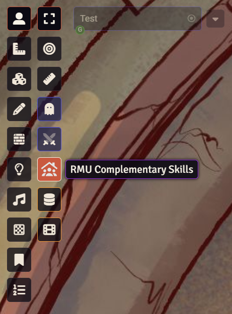
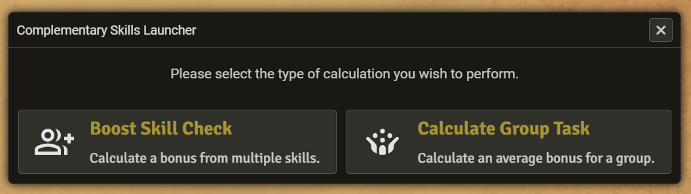
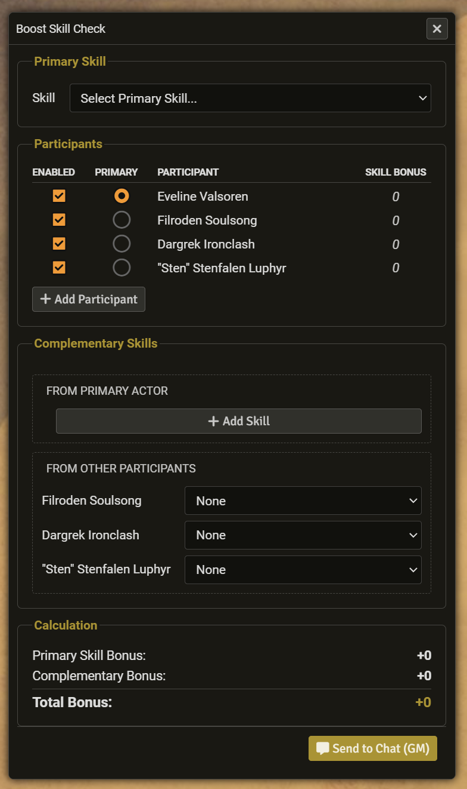
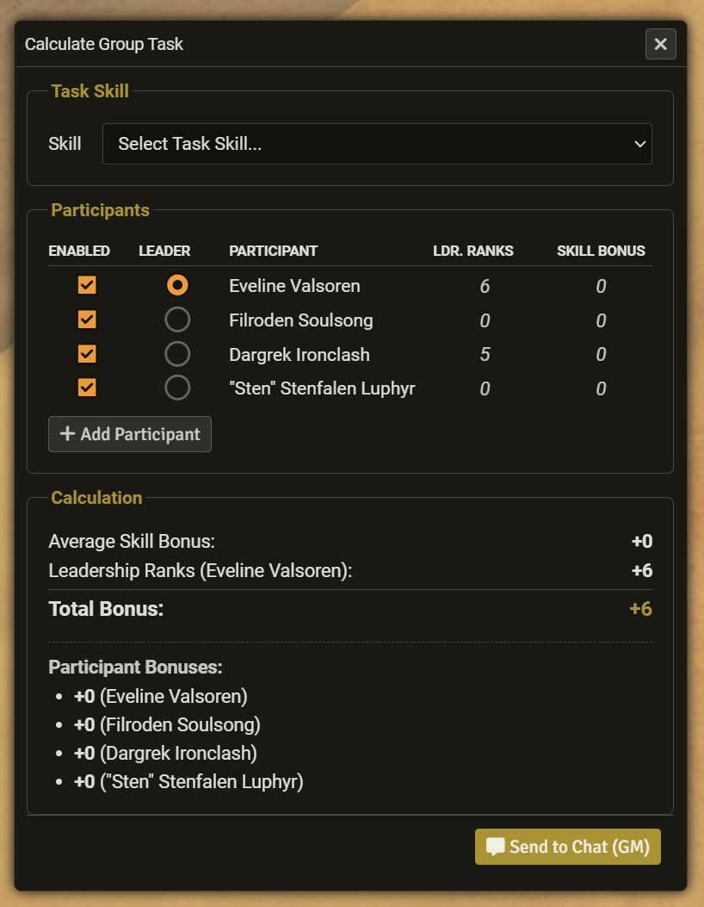
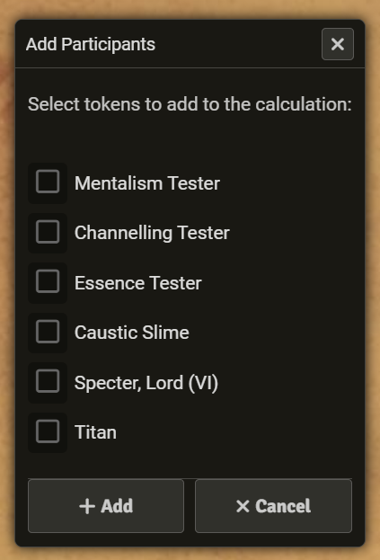

# RMU Complementary Skills Calculator

This module provides Gamemasters with a quick and easy-to-use calculator to automate the RMU complementary skills rules. After selecting one or more tokens on the scene, the GM can click the new icon in the Token Controls palette to open a launcher window. This launcher presents two distinct options: "Boost Skill Check", which is used when multiple skills are combined to help a single roll, and "Calculate Group Task", which is used when a group works together to shorten the time needed for a task.

## How to Use

The calculator is designed for a fast, step-by-step workflow.

1.  **Select Tokens:** On the main scene, select all the tokens you wish to include in the calculation.

2.  **Open the Launcher:** Click the new "Complementary Skills" icon in the Token Controls palette (on the left of the screen).

3.  **Choose a Rule:** A launcher window will appear, pre-loaded with your selected tokens. Choose which calculation you need to perform.

## The Calculators

### 1\. Boost Skill Check

This calculator is used when a primary actor is making a skill check, and other participants (or the primary actor themselves) are using *different* skills to help. It automatically calculates the final bonus, applying the diminishing returns (half, quarter, etc.) for each added skill.

1.  **Select the Primary Skill:** Use the top dropdown menu to choose the main skill being rolled (e.g., "Perception").
2.  **Choose the Primary Actor:** The "Skill Bonus" column will update, showing each participant's total bonus in that skill. Select the "Primary" radio button next to the actor who is making the main roll. Their bonus will be used as the base.
3.  **Add Complementary Skills:**
      * **From Primary Actor:** If the main actor is using additional skills to help themselves, click the "+ Add Skill" button and select their skills from the dropdown.
      * **From Other Participants:** For each *other* participant, you can select one skill they are contributing from their respective dropdown.
4.  **Get the Result:** The "Calculation" box at the bottom will update live, showing the base bonus, the total complementary bonus, and the final combined total.

### 2\. Calculate Group Task

This calculator is used when the whole group is working together on a single task (e.g., "Group Stealth"). It calculates the *average* skill bonus of all enabled participants and adds the *ranks* from the group's leader.

1.  **Select the Task Skill:** Use the top dropdown menu to choose the skill being used by the group (e.g., "Stealth").
2.  **Review Participants:** The list will update, showing each participant's skill bonus and their total ranks in the "Leadership" skill.
3.  **Select the Leader:** The participant with the highest "Ldr. Ranks" will be chosen by default, but you can change this by selecting any "Leader" radio button.
4.  **Get the Result:** The "Calculation" box shows the average skill bonus, the leader's contribution, and the final combined total.

## Common Features

Both calculator windows share these features:

  * **Enable/Disable Participants:** You can temporarily remove a participant from the calculation (to see how it affects the total) by unchecking the "Enabled" box next to their name.

  * **Add Participant:** If you forgot to select a token, click the "+ Add Participant" button. A new dialogue will appear allowing you to add any other tokens from the scene to the calculator.

  * **Send to Chat (GM):** Click the "Send to Chat (GM)" button in the footer to post a formatted summary of the calculation, visible only to you in the chat log.

## Version History

[Version History](https://www.google.com/search?q=VERSION.md)

## Licences

Software and associated documentation files in this repository are covered by an [MIT License](LICENSE.md).

All icons included within the RMU Complementary Skill Calculator module are from Google's Material Design icons (<https://fonts.google.com/icons>) and are licensed under an Apache Licence (version 2.0) (<https://www.apache.org/licenses/LICENSE-2.0.html>).
