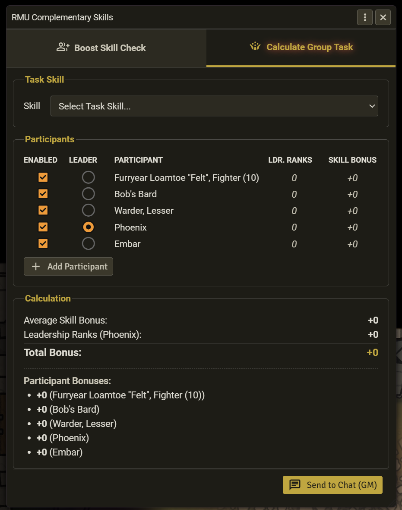
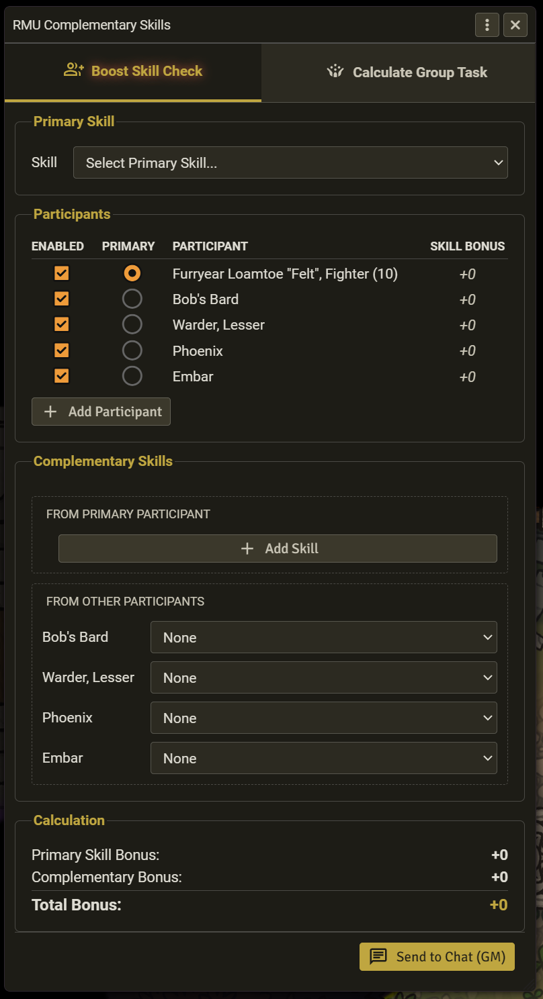
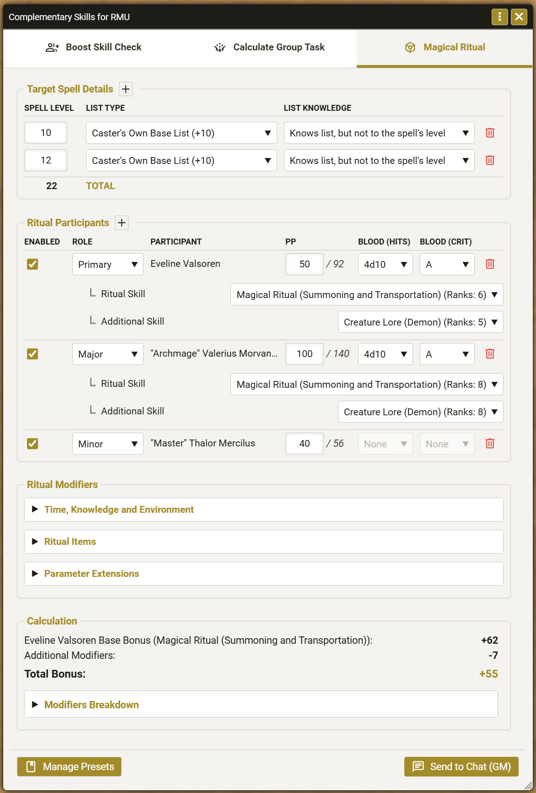
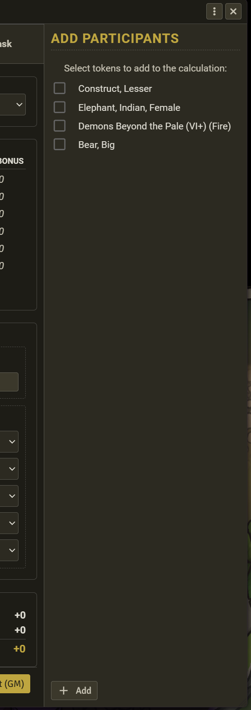
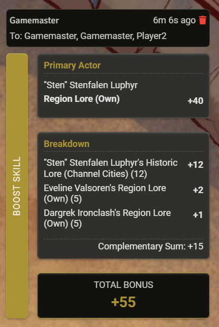
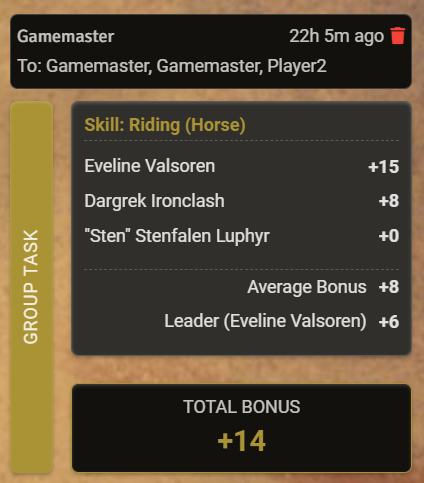
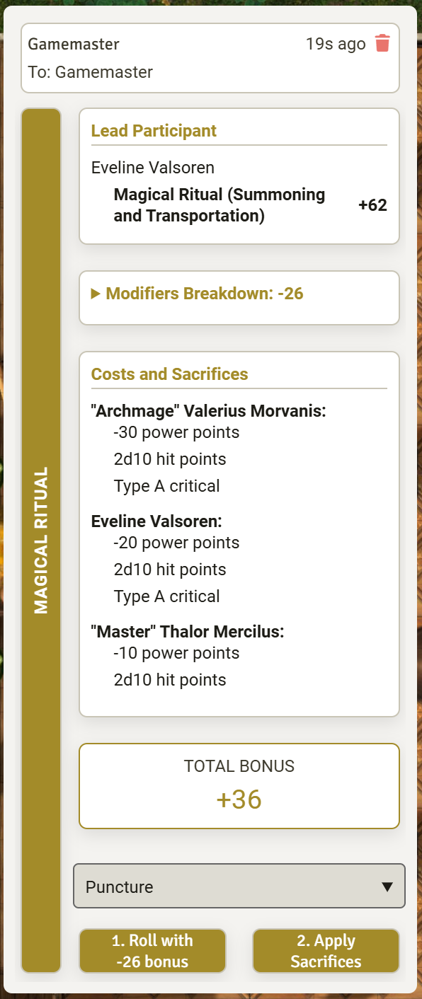

# Complementary Skills Calculator for Rolemaster Unified (RMU)

This module provides Gamemasters with a quick and easy-to-use way to calculate RMU complementary skills and magical ritual manoeuvre rolls.

After selecting one or more tokens on the scene, the GM can click the new icon in the Token Controls palette to open the application. This presents three tabs:

- "Boost Skill Check", which is used when multiple skills are combined to help a single roll.
- "Calculate Group Task", which is used when a group works together to shorten the time needed for a task.
- "Magical Rituals", which is used when they are working together on a magical ritual (including any complementary skills being used).

## How to Use

The calculator is designed for a fast, step-by-step workflow.

1. **Select Tokens:** On the main scene, select all the tokens you wish to include in the calculation.
2. **Open the Application:** Click the new "Complementary Skills" icon in the Token Controls palette (on the left of the screen).
3. **Choose a Rule:** A window will appear with thee tabs, pre-loaded with your selected tokens. Choose which calculation you need to perform.

## The Calculators

### Boost Skill Check

This calculator is used when a primary actor is making a skill check, and other participants (or the primary actor themselves) are using *different* skills to help. It automatically calculates the final bonus, applying the diminishing returns (half, quarter, etc.) for each added skill.

1. **Select the Primary Skill:** Use the top dropdown menu to choose the main skill being rolled (e.g., "Perception").
2. **Choose the Primary Actor:** The "Skill Bonus" column will update, showing each participant's total bonus in that skill. Select the "Primary" radio button next to the actor who is making the main roll. Their bonus will be used as the base.
3. **Add Complementary Skills:**
      - **From Primary Actor:** If the main actor is using additional skills to help themselves, click the "+ Add Skill" button and select their skills from the dropdown.
      - **From Other Participants:** For each *other* participant, you can select one skill they are contributing from their respective dropdown.
4. **Get the Result:** The "Calculation" box at the bottom will update live, showing the base bonus, the total complementary bonus, and the final combined total.

### Calculate Group Task

This calculator is used when the whole group is working together on a single task (e.g., "Group Stealth"). It calculates the *average* skill bonus of all enabled participants and adds the *ranks* from the group's leader.

1. **Select the Task Skill:** Use the top dropdown menu to choose the skill being used by the group (e.g., "Stealth").
2. **Review Participants:** The list will update, showing each participant's skill bonus and their total ranks in the "Leadership" skill.
3. **Select the Leader:** The participant with the highest "Ldr. Ranks" will be chosen by default, but you can change this by selecting any "Leader" radio button.
4. **Get the Result:** The "Calculation" box shows the average skill bonus, the leader's contribution, and the final combined total.

### Magical Ritual Check

This calculator is used when one or more participants are performing a magical ritual. It calculates the total bonus for the ritual, accounting for the spells being cast, the ritual skills and any complementary skills of the participants, any power point, blood, or critical sacrifices made by major and primary contributors, and any other ritual modifiers from Chapter 5 of Spell Law.

1. Complete the details in the tab:
   - Define the spell(s).
   - Define the role of participants and their contribution to the ritual (ritual skills, optional complementary skills, contributions).
   - Open each of the expandable sections to define the ritual modifiers.
2. Once you have completed all the details in the tab, review the calculation results. You can expand the modifiers breakdown section to see how they are calculated.
3. Send the roll to chat.
4. On the chat card, if any participant has chosen to provide a critical sacrifice, choose the type of critical to be applied (default is "Puncture" for a blood critical).
5. Apply the contribution. This will deduct the power points, roll any blood (hit) damage and apply it, and roll the chosen criticals. Critical results will then display in separate chat cards which you must apply individually.
6. Make the skill roll. This will open the skill manoeuvre roll dialogue where additional modifiers might apply to the roll, e.g., existing injury penalties, armour penalties, etc.

> **Note 1:** It is not possible (yet) to contribute power from spell adders within the module.

> **Note 2:** The effects of the ritual (the actual spells) are not automated by the module.

## Common Features

All calculator windows share these features:

- **Enable/Disable Participants:** You can temporarily remove a participant from the calculation (to see how it affects the total) by unchecking the "Enabled" box next to their name. You can also delete a participant from the calculation (to simplify the UI if you choose too many) by using the Delete button aside them.

- **Add Participant:** If you forgot to select a token, click the `+ Add Participant` button. A side panel will slide out, allowing you to  select and add any other tokens from the scene without leaving the calculator.

    

- **Send to Chat (GM):** Click the "Send to Chat (GM)" button in the footer to post a formatted summary of the calculation, visible only to you in the chat log.

  

  
  
  
  

- **Roll Skill (lead participant or GM):** The lead participant or the GM can make the modified skill manoeuvre roll by clicking the button at the bottom of the chat card. The button will be visible to other participants but it will show as disabled. This will launch RMU's skill roll dialogue and show either the additional bonus (for Boost Task) or the override skill bonus (for Group Task). You can still apply any other modifiers as normal in this dialogue before rolling.

## Licences

Software and associated documentation files in this repository are covered by an [MIT License](LICENSE.md).

All icons included within the RMU Complementary Skill Calculator module are from Google's Material Design icons (<https://fonts.google.com/icons>) and are licensed under an Apache Licence (version 2.0) (<https://www.apache.org/licenses/LICENSE-2.0.html>).

## Disclaimer and IP Notice

The Complementary Skills Calculator for RMU module is an unofficial, community-developed tool designed to enhance the Rolemaster Unified experience on Foundry Virtual Tabletop.

This module is completely independent and is not affiliated with, endorsed, sponsored, or approved by Iron Crown Enterprises (ICE). "Rolemaster", "Rolemaster Unified", and the "RMU" acronym are trademarks of Iron Crown Enterprises.

This project does not distribute any proprietary text, artwork, or core rulebook content belonging to ICE. It functions strictly as a mechanical, workflow, and user interface enhancement for the official RMU system on Foundry VTT. Any use of specific system terminology or mechanical values is for functional compatibility purposes only.
